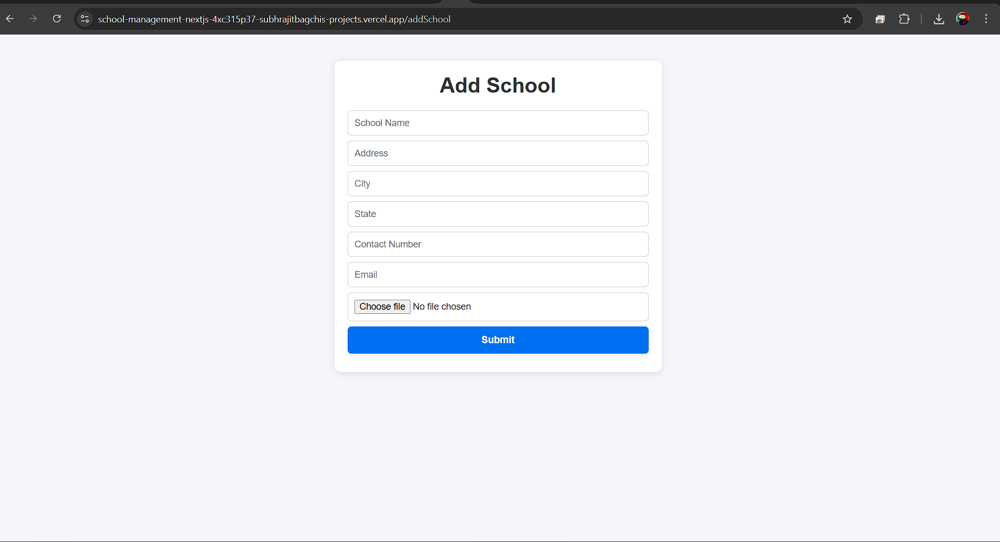

# 📘 School Management (Next.js + MySQL + Cloudinary)

This is a small full-stack project built as part of a web development assignment.
The app allows users to **add schools** (with details and an image) and **view schools** in a grid layout.

---

## 🚀 Features

* Add new schools with:

  * Name, Address, City, State, Contact, Email
  * Upload a school image (stored in Cloudinary)
* Responsive design (works on desktop & mobile)
* View all added schools in a clean grid (like products in an e-commerce site)
* MySQL database hosted on Railway
* Deployed on Vercel for easy access

---

## 📂 Tech Stack

* **Next.js 13 (App Router)** – frontend + backend APIs
* **React Hook Form** – form validation
* **MySQL (Railway)** – database
* **Cloudinary** – image storage
* **Vercel** – hosting

---

## ⚙️ Setup Instructions

If you want to run this project locally:

1. **Clone the repo**

   ```bash
   git clone https://github.com/SBagchi67/school-management-nextjs.git
   cd school-management-nextjs
   ```

2. **Install dependencies**

   ```bash
   npm install
   ```

3. **Create a `.env.local` file** in the root folder and add:

   ```
   DB_HOST=your-db-host
   DB_USER=your-db-user
   DB_PASSWORD=your-db-password
   DB_NAME=your-db-name
   DB_PORT=your-db-port

   CLOUDINARY_CLOUD_NAME=your-cloud-name
   CLOUDINARY_API_KEY=your-cloud-api-key
   CLOUDINARY_API_SECRET=your-cloud-api-secret
   ```

   > (These values come from Railway for DB, and Cloudinary for image storage)

4. **Run the project**

   ```bash
   npm run dev
   ```

   Open [http://localhost:3000](http://localhost:3000)

---

## 🌐 Live Demo

* **Frontend (Vercel)**: https://school-management-nextjs-tawny.vercel.app/
* **GitHub Repo**: [https://github.com/SBagchi67/school-management-nextjs](https://github.com/SBagchi67/school-management-nextjs)

---

## 📸 Screenshots

*Add a couple of screenshots of your `/addSchool` form and `/showSchools` page here to make it look nice.*

## 📸 Screenshots

### Add School Page


### Show Schools Page


---

## ✨ Author

Developed by **Subhrajit Bagchi** as part of a web development assignment.


👉 Do you want me to also give you a **sample screenshots section** (with markdown image tags), so you can just upload your screenshots and link them?
